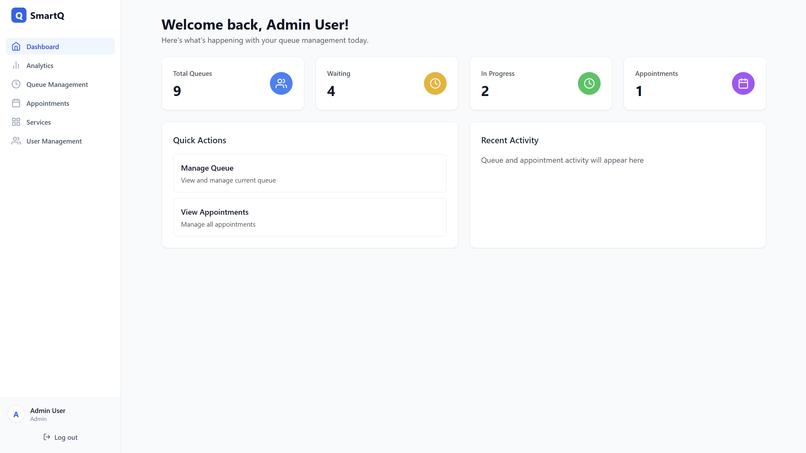
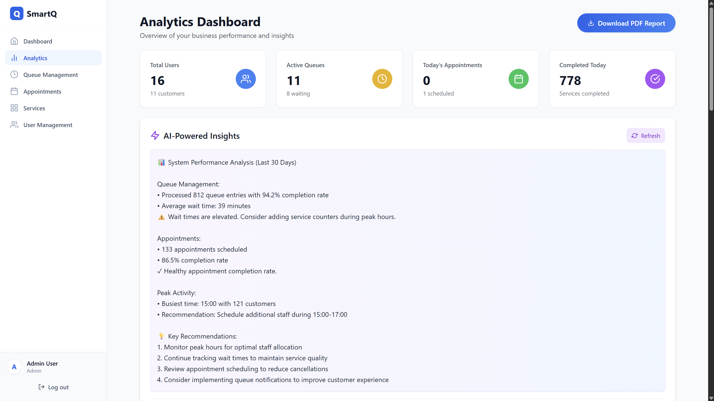
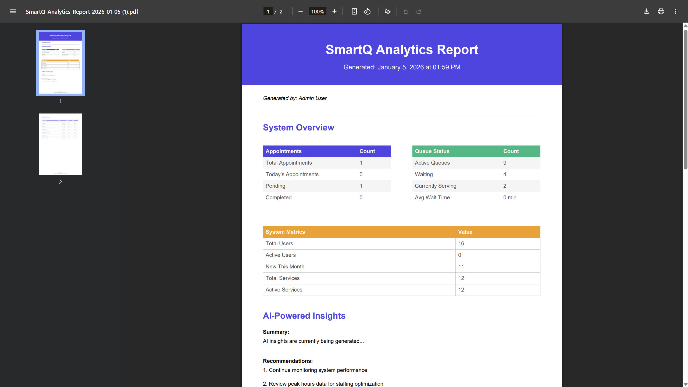

# SmartQ - Intelligent Queue & Appointment Management System

<div align="center">

**A modern, AI-powered queue and appointment management system built with the MERN stack**

[](https://www.typescriptlang.org/)
[](https://reactjs.org/)
[](https://nodejs.org/)
[](https://www.mongodb.com/)
[](https://tailwindcss.com/)

[Live Demo](https://smartq-nrs8kzxtf-shehans-projects-a755a7eb.vercel.app) | [API Documentation](#api-endpoints)

</div>

---

## Table of Contents

- [About The Project](#about-the-project)
- [Key Features](#key-features)
- [AI-Powered Features](#ai-powered-features)
- [Tech Stack](#tech-stack)
- [Architecture Overview](#architecture-overview)
- [Getting Started](#getting-started)
- [Environment Variables](#environment-variables)
- [Deployment](#deployment)
- [Screenshots](#screenshots)
- [API Endpoints](#api-endpoints)
- [Author](#author)

---

## About The Project

**SmartQ** is a comprehensive queue and appointment management solution designed for businesses that need to efficiently manage customer flow. Whether it's a hospital, bank, government office, or any service-based organization, SmartQ provides real-time queue tracking, intelligent appointment scheduling, and AI-powered analytics to optimize customer service.

The system features a modern, responsive interface with role-based access control, supporting three user types: **Customers**, **Staff**, and **Administrators**.

### Why SmartQ?

- **Reduce Wait Times**: AI-powered predictions help customers choose optimal appointment slots
- **Improve Efficiency**: Real-time queue management streamlines service delivery
- **Data-Driven Decisions**: Comprehensive analytics with AI-generated insights
- **Multi-Currency Support**: Supports 8 currencies with LKR as the base currency
- **PDF Reports**: Generate professional analytics reports for management review

---

## Key Features

### For Customers
| Feature | Description |
|---------|-------------|
| **User Registration & Authentication** | Secure JWT-based authentication with role management |
| **Appointment Booking** | Book appointments with preferred date, time, and service |
| **Queue Management** | Join virtual queues for walk-in services |
| **Real-time Updates** | Live queue position tracking and estimated wait times |
| **Appointment History** | View all past and upcoming appointments |
| **Multi-Currency View** | View service prices in 8 different currencies |
| **Cancel/Reschedule** | Flexible appointment and queue cancellation |

### For Staff
| Feature | Description |
|---------|-------------|
| **Queue Dashboard** | Real-time view of all active queues |
| **Status Management** | Update queue status (waiting → in-progress → completed) |
| **Appointment Overview** | View and manage all scheduled appointments |
| **Customer Notifications** | Automatic status updates for customers |
| **Service Counter Management** | Assign and manage service counters |

### For Administrators
| Feature | Description |
|---------|-------------|
| **Comprehensive Dashboard** | Real-time statistics and KPIs |
| **User Management** | Create, update, and manage all user accounts |
| **Service Configuration** | Add, edit, and remove services with pricing |
| **AI Analytics** | Intelligent insights powered by Google Gemini AI |
| **PDF Report Generation** | Download professional analytics reports |
| **Queue Analytics** | Historical data and performance metrics |

---

## AI-Powered Features

SmartQ integrates **Google Gemini AI** (gemini-1.5-flash model) to provide intelligent features:

### 1. AI Booking Suggestions
- **Smart Time Recommendations**: AI analyzes historical data to suggest optimal booking times
- **Wait Time Predictions**: Estimates expected wait times based on queue patterns
- **Peak Hour Alerts**: Warns customers about busy periods

### 2. AI Queue Analytics
- **Queue Efficiency Analysis**: Automated analysis of service efficiency by department
- **Peak Hour Detection**: Identifies busiest times for better resource allocation
- **Performance Insights**: AI-generated recommendations for improving service delivery

### 3. AI-Generated Insights Dashboard
- **Natural Language Summaries**: Human-readable insights about queue performance
- **Trend Analysis**: Automatic detection of patterns and anomalies
- **Actionable Recommendations**: AI suggests improvements based on data analysis

### 4. Intelligent Fallback System
When the AI service is unavailable, SmartQ automatically generates data-driven insights using statistical analysis of actual queue and appointment data, ensuring uninterrupted functionality.

---

## Tech Stack

### Frontend
| Technology | Purpose |
|------------|---------|
| **React 18** | UI Component Library |
| **TypeScript** | Type-safe JavaScript |
| **Redux Toolkit** | State Management |
| **React Router v6** | Client-side Routing |
| **TailwindCSS** | Utility-first CSS Framework |
| **Vite** | Build Tool & Dev Server |
| **Axios** | HTTP Client |
| **React Hot Toast** | Toast Notifications |
| **jsPDF** | PDF Generation |
| **React Icons** | Icon Library |

### Backend
| Technology | Purpose |
|------------|---------|
| **Node.js** | Runtime Environment |
| **Express.js** | Web Framework |
| **TypeScript** | Type-safe JavaScript |
| **MongoDB** | NoSQL Database |
| **Mongoose** | MongoDB ODM |
| **JWT** | Authentication |
| **bcryptjs** | Password Hashing |
| **Express Validator** | Input Validation |
| **Google Generative AI** | AI Integration (Gemini) |

### DevOps & Deployment
| Technology | Purpose |
|------------|---------|
| **Vercel** | Frontend Hosting |
| **Render / Railway** | Backend Hosting (Recommended) |
| **MongoDB Atlas** | Cloud Database |
| **GitHub** | Version Control |

---

## Architecture Overview

```
┌─────────────────────────────────────────────────────────────────────┐
│                          CLIENT (React + Vite)                       │
│  ┌─────────────┐  ┌─────────────┐  ┌─────────────┐  ┌─────────────┐ │
│  │    Pages    │  │  Components │  │   Redux     │  │  Services   │ │
│  │  - Login    │  │  - Layout   │  │   Store     │  │  - API      │ │
│  │  - Dashboard│  │  - Queue    │  │  - Auth     │  │  - Auth     │ │
│  │  - Queue    │  │  - AI       │  │  - Queue    │  │  - Queue    │ │
│  │  - Services │  │  - Common   │  │  - Services │  │  - AI       │ │
│  └─────────────┘  └─────────────┘  └─────────────┘  └─────────────┘ │
└────────────────────────────┬────────────────────────────────────────┘
                             │ HTTPS (REST API)
                             ▼
┌─────────────────────────────────────────────────────────────────────┐
│                        SERVER (Node.js + Express)                    │
│  ┌─────────────┐  ┌─────────────┐  ┌─────────────┐  ┌─────────────┐ │
│  │   Routes    │  │ Controllers │  │   Models    │  │  Services   │ │
│  │  - /auth    │  │  - Auth     │  │  - User     │  │  - Gemini   │ │
│  │  - /queue   │  │  - Queue    │  │  - Queue    │  │    AI       │ │
│  │  - /ai      │  │  - AI       │  │  - Service  │  │             │ │
│  │  - /users   │  │  - Users    │  │  - Appoint  │  │             │ │
│  └─────────────┘  └─────────────┘  └─────────────┘  └─────────────┘ │
└────────────────────────────┬────────────────────────────────────────┘
                             │
                             ▼
┌─────────────────────────────────────────────────────────────────────┐
│                         MONGODB ATLAS                                │
│  ┌──────────┐  ┌──────────┐  ┌──────────┐  ┌──────────┐            │
│  │  Users   │  │  Queues  │  │ Services │  │Appointments│           │
│  └──────────┘  └──────────┘  └──────────┘  └──────────┘            │
└─────────────────────────────────────────────────────────────────────┘
```

### Folder Structure

```
SmartQ/
├── client/                    # React Frontend
│   ├── src/
│   │   ├── components/        # Reusable UI components
│   │   │   ├── ai/           # AI-related components
│   │   │   ├── analytics/    # Analytics dashboard
│   │   │   ├── auth/         # Authentication guards
│   │   │   ├── common/       # Shared UI components
│   │   │   ├── layout/       # Layout components
│   │   │   └── queue/        # Queue-related components
│   │   ├── pages/            # Page components
│   │   ├── services/         # API service layer
│   │   ├── store/            # Redux store & slices
│   │   ├── types/            # TypeScript interfaces
│   │   └── utils/            # Utility functions
│   └── ...
│
├── server/                    # Node.js Backend
│   ├── src/
│   │   ├── config/           # Database configuration
│   │   ├── controllers/      # Route controllers
│   │   ├── middleware/       # Express middleware
│   │   ├── models/           # Mongoose schemas
│   │   ├── routes/           # API routes
│   │   ├── scripts/          # Database seed scripts
│   │   ├── services/         # Business logic (AI, etc.)
│   │   ├── types/            # TypeScript interfaces
│   │   └── utils/            # Utility functions
│   └── ...
│
├── screenshots/              # Application screenshots
└── README.md                 # This file
```

---

## Getting Started

### Prerequisites

- **Node.js** v16 or higher
- **npm** or **yarn**
- **MongoDB Atlas** account (or local MongoDB)
- **Google AI API Key** (for Gemini AI features) - [Get it free here](https://makersuite.google.com/app/apikey)

### Installation

#### 1. Clone the Repository

```bash
git clone https://github.com/shehan-anujaya/SmartQ.git
cd SmartQ
```

#### 2. Backend Setup

```bash
# Navigate to server directory
cd server

# Install dependencies
npm install

# Create environment file
cp .env.example .env

# Edit .env with your credentials (see Environment Variables section)

# Seed the database with sample data
npm run seed:users
npm run seed:services

# Start development server
npm run dev
```

The backend will run on `http://localhost:5000`

#### 3. Frontend Setup

```bash
# Navigate to client directory
cd client

# Install dependencies
npm install

# Create environment file
echo "VITE_API_URL=http://localhost:5000/api" > .env

# Start development server
npm run dev
```

The frontend will run on `http://localhost:3001`

### Default Users

After seeding, you can login with these credentials:

| Role | Email | Password |
|------|-------|----------|
| Admin | admin@smartq.com | Admin@123 |
| Staff | staff@smartq.com | Staff@123 |
| Customer | john@example.com | Customer@123 |

---

## Environment Variables

### Backend (server/.env)

```env
# Server Configuration
PORT=5000
NODE_ENV=development

# Database
MONGODB_URI=mongodb+srv://<username>:<password>@cluster.mongodb.net/smartq

# JWT Configuration
JWT_SECRET=your_super_secret_jwt_key_change_in_production
JWT_EXPIRE=7d

# CORS
CLIENT_URL=http://localhost:3001

# AI Configuration (Google Gemini)
GEMINI_API_KEY=your_google_gemini_api_key
```

### Frontend (client/.env)

```env
# API Configuration
VITE_API_URL=http://localhost:5000/api
```

### Getting API Keys

1. **MongoDB Atlas**: Create a free cluster at [mongodb.com](https://www.mongodb.com/cloud/atlas)
2. **Google Gemini API**: Get a free API key at [Google AI Studio](https://makersuite.google.com/app/apikey)

---

## Deployment

### Live URLs

| Component | URL |
|-----------|-----|
| **Frontend** | [https://smartq-nrs8kzxtf-shehans-projects-a755a7eb.vercel.app](https://smartq-nrs8kzxtf-shehans-projects-a755a7eb.vercel.app) |
| **Backend API** | [https://smartq-production.up.railway.app](https://smartq-production.up.railway.app) |

### Deploy Frontend to Vercel

1. Push your code to GitHub
2. Connect your repository to [Vercel](https://vercel.com)
3. Set the root directory to `client`
4. Add environment variable: `VITE_API_URL=your_backend_url`
5. Deploy!

### Deploy Backend to Render

1. Push your code to GitHub
2. Create a new Web Service on [Render](https://render.com)
3. Set the root directory to `server`
4. Set build command: `npm install && npm run build`
5. Set start command: `npm start`
6. Add all environment variables from `.env`
7. Deploy!

---

## Screenshots

### Dashboard

*Admin dashboard with real-time statistics and KPIs*

### Analytics Dashboard

*Comprehensive analytics dashboard with insights*

### AI Analytics

*AI-powered analytics with intelligent insights*

### Queue Management

*Real-time queue management interface*

### Appointment Management

*Appointment booking and management interface*

### Services Management

*Service configuration with multi-currency support*

### User Management

*Admin user management panel*

### PDF Reports

*Generated PDF analytics report for download*

---

## API Endpoints

### Authentication
| Method | Endpoint | Description |
|--------|----------|-------------|
| POST | `/api/auth/register` | Register new user |
| POST | `/api/auth/login` | User login |
| GET | `/api/auth/me` | Get current user |

### Users
| Method | Endpoint | Description |
|--------|----------|-------------|
| GET | `/api/users` | Get all users (Admin) |
| GET | `/api/users/:id` | Get user by ID |
| PUT | `/api/users/:id` | Update user |
| DELETE | `/api/users/:id` | Delete user (Admin) |

### Services
| Method | Endpoint | Description |
|--------|----------|-------------|
| GET | `/api/services` | Get all services |
| POST | `/api/services` | Create service (Admin) |
| PUT | `/api/services/:id` | Update service (Admin) |
| DELETE | `/api/services/:id` | Delete service (Admin) |

### Queue
| Method | Endpoint | Description |
|--------|----------|-------------|
| GET | `/api/queue` | Get all queues |
| POST | `/api/queue` | Join queue |
| PUT | `/api/queue/:id/status` | Update queue status |
| GET | `/api/queue/position/:id` | Get queue position |
| GET | `/api/queue/stats` | Get queue statistics |

### Appointments
| Method | Endpoint | Description |
|--------|----------|-------------|
| GET | `/api/appointments` | Get all appointments |
| POST | `/api/appointments` | Create appointment |
| PUT | `/api/appointments/:id` | Update appointment |
| DELETE | `/api/appointments/:id` | Cancel appointment |

### AI
| Method | Endpoint | Description |
|--------|----------|-------------|
| GET | `/api/ai/booking-suggestions` | Get AI booking suggestions |
| GET | `/api/ai/wait-time/:serviceId` | Get AI wait time prediction |
| GET | `/api/ai/queue-efficiency` | Get AI queue analytics |

---

## Supported Currencies

SmartQ supports 8 currencies with real-time conversion:

| Currency | Code | Symbol |
|----------|------|--------|
| Sri Lankan Rupee | LKR | Rs. |
| US Dollar | USD | $ |
| Euro | EUR | € |
| British Pound | GBP | £ |
| Indian Rupee | INR | ₹ |
| Australian Dollar | AUD | A$ |
| Canadian Dollar | CAD | C$ |
| Japanese Yen | JPY | ¥ |

---

## Contributing

Contributions are welcome! Please feel free to submit a Pull Request.

1. Fork the repository
2. Create your feature branch (`git checkout -b feature/AmazingFeature`)
3. Commit your changes (`git commit -m 'Add some AmazingFeature'`)
4. Push to the branch (`git push origin feature/AmazingFeature`)
5. Open a Pull Request

---

## License

This project is licensed under the MIT License - see the [LICENSE](LICENSE) file for details.

---

## Author

<div align="center">

### Shehan Anujaya

[](https://github.com/shehan-anujaya)
[](https://linkedin.com/in/shehan-anujaya)

---

**Made with ❤️ in Sri Lanka**

</div>

---

<div align="center">

⭐ **Star this repository if you find it helpful!** ⭐

</div>
